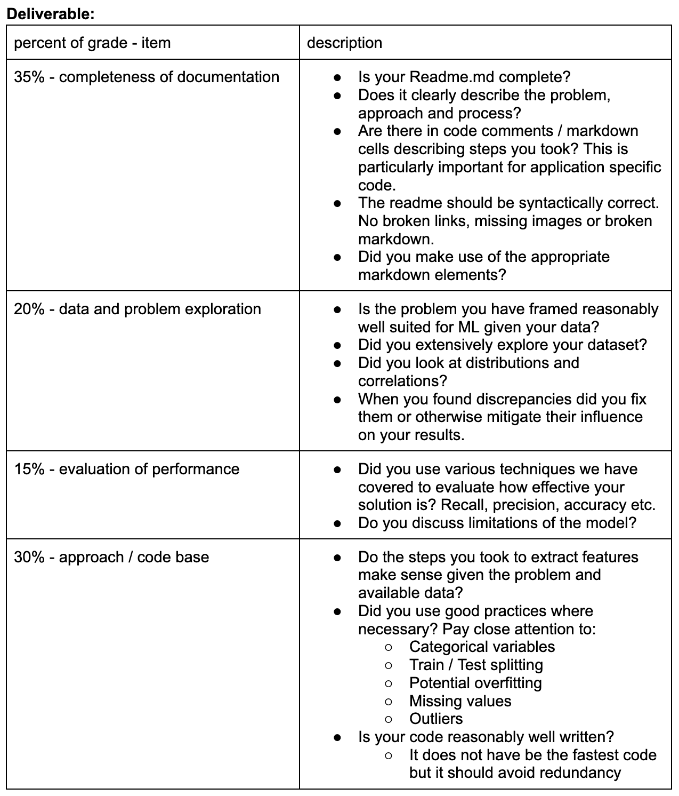
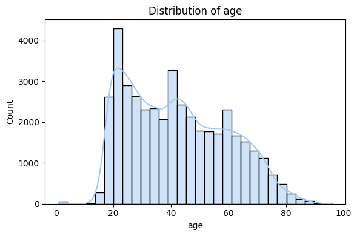
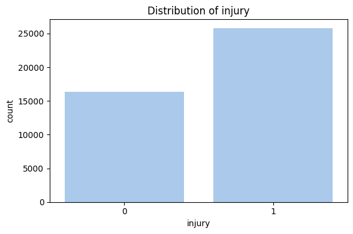
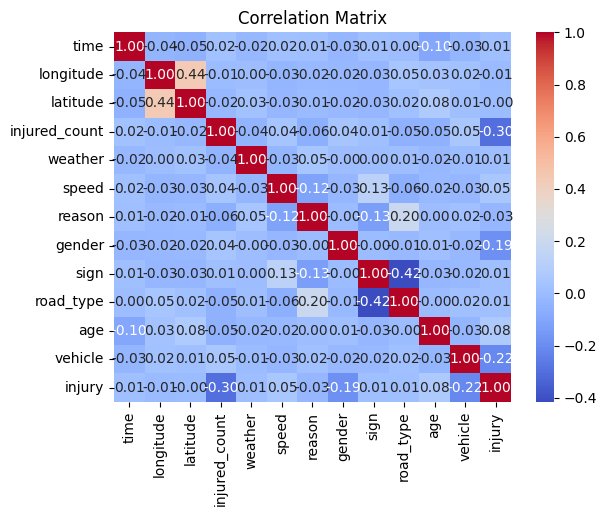

# 2025_ia651_shih
ChingWenShih_0993229_SP25ML
Machine Learning Final Project Proposal

## First Meeting Explanation (3/25)
About my topic chosen reason:
- Plan A: Respiratory disease carry on from data mining class, but I got most variables categorical, not numeric can't do most techniques we learned in class.
- Plan B: US Traffic Accidents Data Analysis, but many people have done it with the same dataset.
- Plan C: Recreate a model for Taiwanese transportation based on previous research.

### Difficult points:
- Dataset is in Mandarin, so I have to translate all words and transform them into new 'Model Label' and 'Categories/Range' for research use.
- The preprocessing part is time consuming, incuding combining 2 dataset based on the unique ID, remove null and invalid values. I got n = 42,143 after cleansing.
- The basic correlation matrix seems like these factors are not very highly correlated to each other, so I need to try other machine learning technique to look into other valuable association. 

### Abstract (explain what is this research for?)
The goal of this study is to analyze the relationship between various factors (such as vehicle type, weather conditions, speed, gender, age, etc.) and the severity of traffic accidents. Specifically, we aim to explore whether these factors can help predict the number of injuries or fatalities in accidents, and identify potential risk factors that could inform traffic safety policies.

- Exploratory Data Analysis (EDA): Use visualization techniques (e.g., scatter plots, box plots, heatmaps) to explore relationships between variables, especially how they relate to injury counts.
- Modeling and Prediction: Build machine learning models (e.g., linear regression, decision trees, random forests) to predict injury counts or accident types based on factors like speed, weather, gender, and vehicle type.
- Clustering Analysis: Apply clustering algorithms (e.g., K-means) to categorize accidents into different groups, helping to identify patterns or special characteristics of specific accident types.

### Questions
- Do I need to change dataset if this one doesn't have strong correlation? -> No
- Is data itself more important or the way I handle it? -> The way
- What suggestions do you have for my project? -> Looks good so far. Figure out whether you want to predict number of injuries or deaths or injury. Is it a categorical problem or a regression?

## Second Meeting Updates: (4/21)
After conversion, the data preprocessing is done. The main target of this research is to focus on predicting the number of injuries and deaths. It is a binary classification problem. The main task is predicting whether an accident results in injury or death (1), or no injury (0).

- Add git ignore file??
- Workflow: Check factors -> Check method -> Do train test split -> Get result and plots -> Explain results -> Finish documentation -> Upload git -> Second meeting get suggestion -> Fix problems and submit(deadline 5/7).

Model candidates: 
- Logistic Regression: A simple baseline, good for interpreting coefficients.
- Support Vector Classifier (SVC): Great for finding margins, handles non-linear boundaries with kernel tricks.
- Decision Trees / Random Forests: Capture non-linear relationships and interactions without much preprocessing.
* These are interpretable, fit the problem (binary classification), and were covered in class. Random Forests tend to perform well without needing much feature scaling or heavy tuning.

- check the grading list!! 



# Doucumentation and details
## Introduction

Reducing traffic accident severity remains a crucial approach to improving road safety. In addition to passive safety systems such as seat belts, airbags, and brake assist systems, predictive models have become a key research focus in recent years. Machine learning and deep learning techniques are increasingly preferred over traditional statistical methods due to their higher accuracy and faster computation speeds. However, training these models requires large datasets, which often suffer from data imbalance issues. Proper preprocessing is essential to address this challenge.

This study categorizes traffic accident severity into three levels: fatal, injury, and non-injury, framing the problem as a multi-class classification task. Collecting the latest traffic accident data from 2024 Tainan Open Data. The findings of the study can contribute to future autonomous vehicle safety systems and provide valuable insights for transportation authorities in making data-driven policy decisions.

## Data Sources
This study is based on a Taiwanese transportation research (胡大瀛、李岳洪（2022）。數據不平衡下以機器學習方法預測交通事故嚴重性之分析，Machine Learning Methods for Traffic Accident Severity Prediction Under Imbalanced Data。運輸計劃季刊，51(4)，275-301。https://www.airitilibrary.com/Article/Detail?DocID=10177159-N202302090004-00002) and implement the latest data to recreate meachine learning model. It utilizes open data from the Tainan City Government's public database (https://data.tainan.gov.tw/) as the primary source for analysis. The database is designed to facilitate access to Taiwanese government-provided open data, offering a standardized platform that ensures data quality and accessibility. Beyond serving as a repository for public administrative information, the platform acts as a content service hub, enabling researchers and businesses to efficiently obtain relevant data for further studies or software development.

### Traffic Accident Data Collection
When a traffic accident occurs and is reported, the police document the incident using two separate forms:

1. Traffic Accident Cause and Casualty Statistics (https://data.tainan.gov.tw/dataset/policedata016) – This form records event-level details such as case ID, date, time, location (latitude & longitude), accident category, road conditions, weather, speed limits, traffic signals, and contributing factors. For the year 2024, this dataset contains 22,384 records.

2. Traffic Accident Involved Parties Statistics (https://data.tainan.gov.tw/dataset/trafowner) – This form focuses on individual-level information, including case ID, party sequence, nationality, gender, age, vehicle type, injury severity, major injury location, protective equipment used, and cause classification. The 2024 dataset contains 50,426 records.

## Data Processing & Variable Definition
To analyze accident severity, the two datasets are merged using case IDs, with missing or erroneous records removed. Since the accident cause dataset is event-based and the involved parties dataset is individual-based, the final processed dataset contains 50,418 samples. About this research, it's a regression model that will be predicting the accident injuries and deaths (Accident Severity as Y variable), and other facotrs as X variables.

Due to the extensive number of accident causes recorded by the police, some categories appear infrequently, which may impact machine learning model training. To address this, accident causes have been consolidated into ten broader categories based on guidelines from the Ministry of the Interior and prior research (e.g., Al-Ghamdi). These categories include speeding, running red lights, tailgating, lane errors, failure to yield, other driver-related factors, mechanical failure, pedestrian/passenger fault, traffic control issues, and other unspecified causes. The final dataset structure is summarized as below.


### Variables and Categorization

| Variable Name        | Model Label  | Definition                               | Categories/Range |
|----------------------|-------------|------------------------------------------|------------------|
| **Month**           | `month`      | Based on the month of occurrence        | 1–12            |
| **Time**            | `time`       | Recorded in hours                        | 0–24            |
| **Weather**         | `weather`    | Weather condition of the day             | Sunny: 1, Cloudy: 2, Rainy: 3 |
| **Speed Limit**     | `speed`      | Speed limit at the time of the accident  | 0–100           |
| **Road Type**       | `road_type`  | Accident location classification        | Intersection: 1, Road section: 2, Other: 3 |
| **Traffic Signal Type** | `sign` | Type of traffic signal at the accident site | No signal: 1, Traffic control signal: 2, Traffic control signal (with pedestrian signal): 3, Flashing signal: 4 |
| **Cause of Accident** | `reason` | Categorized accident cause               | Speeding: 1, Running a red light: 2, Tailgating: 3, Lane violation: 4, Failure to yield: 5, Other driver-related factors: 6, Mechanical failure: 7, Pedestrian/passenger fault: 8, Traffic control (infrastructure) defect: 9, Other unspecified causes: 10 |
| **Gender**         | `gender`     | Gender of the involved party             | Male: 1, Female: 2 |
| **Age**            | `age`        | Age recorded at the time of the accident | 1–115           |
| **Vehicle Type**   | `vehicle`    | Type of vehicle involved                 | Passenger car/light truck: 1, Motorcycle: 2, Pedestrian: 3, Other (bus, heavy truck, trailer, special vehicle): 4 |
| **Accident Severity** | `injury` | Severity of the accident                 | Fatality: 1, Injury: 2, No injury: 3 |


### What is the distribution of each feature?  
- Here's age factor distribution for example. The main y factor is injury, which is imbalance here because in the dataset, we have more people got injured than not. (After cleansing, I merged fatal data with injured data, so 1 and 2 are combined.)



### Correlation - are some features strongly correlated?  
- From the correlation matrix, I understand that in this dataset, these factors don't have very strong assosiation between each other. But the road_type and sign have weak negative assosiation (-0.42).


### Feature importance
- Yes, I am currently using all available features as input variables (X) for the classification task. Since the dataset is relatively small and each feature may contain useful signals about injury outcomes (e.g., time, location, weather, vehicle type, etc.), excluding features prematurely might reduce model performance. 
- Furthermore, some variables like speed, reason, or vehicle have strong potential to be predictive of accident severity, so keeping the full set allows the model to learn any underlying relationships without introducing bias through manual exclusion.

### Feature engineering
- Several categorical features required encoding to be used in machine learning models. For example, variables like gender, vehicle, weather, road_type, and sign were encoded using label encoding, as they have a limited number of categories and are ordinal or can be interpreted as such. This helps avoid increasing dimensionality unnecessarily compared to one-hot encoding.

- For features like reason, which have many unique values (over 70), I grouped them into broader categories (e.g., speeding, red light violations, mechanical failure) to reduce sparsity and improve generalizability—this is an example of custom categorical grouping, a more advanced form of feature engineering.

- At this stage, I haven’t implemented cross-feature combinations (e.g., interaction between vehicle and speed), but these could potentially improve the model. For instance, high speed with a heavy vehicle may be more dangerous than high speed with a motorcycle. Creating such cross features could be explored during model tuning or through tree-based models that naturally learn interactions.

## Model fitting
### Train / test splitting
- How was this performed? How did you decide the train/test sizes?
-> To evaluate model performance, I randomly split the dataset into a training set and a test set using an 80/20 ratio. This is a commonly used split that balances the need for sufficient training data with enough unseen data to evaluate generalization. The train_test_split() function from scikit-learn was used, with a random_state set for reproducibility.

- Does your dataset have a risk of data leakage? Describe those risks. This is usually true for time series datasets.
-> This dataset does not have a high risk of data leakage because all features represent information that would be available before or at the time of the accident. Additionally, in this case, the model does not rely on sequence or prediction into the future, so random splitting is acceptable.

### Model selection

To predict whether a person involved in a traffic accident is injured or not (injury as binary classification: 0 = not injured, 1 = injured or dead), I tried several classification models covered in class: Logistic Regression, SVM, and Decision Trees / Random Forests. Trying multiple model types helps explore which assumptions best fit the structure of the data.

1. Logistic Regression
- Reason for choosing this model: Logistic Regression is a simple yet powerful linear model used for binary classification problems. It's easy to interpret and serves as a good baseline to compare more complex models against. Since our target variable is binary (injured or not), logistic regression is an appropriate starting point.

- Hyperparameter selection: I used the default parameters for the initial run. Optionally, regularization strength (C) can be tuned using cross-validation (e.g., GridSearchCV) to prevent overfitting.


2. Support Vector Machines
- Reason of choosing this model: Support Vector Machines (SVM) can handle high-dimensional data and are effective when the classes are not linearly separable. SVM tries to find the best decision boundary with maximum margin, making it a strong candidate for more complex decision surfaces.

- Hyperparameter selection: I experimented with different kernels (linear, rbf) and adjusted the regularization parameter C using GridSearchCV. For non-linear kernels, the gamma parameter was also tuned. However, due to the size of the dataset, SVM was slower to train compared to other models.

3. Decision Tree / Random Forests
- Reason of choosing this model: Tree-based models are very effective for handling both numerical and categorical variables, and they naturally model feature interactions. Random Forests in particular reduce overfitting by averaging predictions across multiple trees. They also provide feature importance, helping in interpretability.

- Hyperparameter selection: I used GridSearchCV to tune key parameters such as: max_depth (tree depth), n_estimators (number of trees), min_samples_split and min_samples_leaf.


## Validation / metrics
1. Logistic Regression explanation:
- Confusion matrix: From the result, we can see that 74% overall accuracy means the model predicts the correct injury class 74% of the time. Recall for class 1 (injured): 93% indicating that the model captures most injured cases. This is valuable in safety-critical applications where missing an injury case (false negative) could be serious. Precision for class 0 (not injured): 0.79 shows that when the model predicts "not injured," it's right about 79% of the time.

- Highlight model weakness: From the result, it seems like the model tends to over-predict injury, resulting in many false positives (1,802 cases). This might be due to class imbalance or feature limitations.

```
Confusion Matrix:
 [[1441 1802]
 [ 375 4811]]

Classification Report:
               precision    recall  f1-score   support

           0       0.79      0.44      0.57      3243
           1       0.73      0.93      0.82      5186

    accuracy                           0.74      8429
   macro avg       0.76      0.69      0.69      8429
weighted avg       0.75      0.74      0.72      8429
```
The result after GridSearchCV (Fitting 3 folds for each of 4 candidates, totalling 12 fits) shown as following:
```
Confusion Matrix:
[[1436 1807]
 [ 372 4814]]

 Classification Report:
              precision    recall  f1-score   support

           0       0.79      0.44      0.57      3243
           1       0.73      0.93      0.82      5186

    accuracy                           0.74      8429
   macro avg       0.76      0.69      0.69      8429
weighted avg       0.75      0.74      0.72      8429
```

```py
param_grid = {
    'logreg__C': [0.01, 0.1, 1, 10],
    'logreg__penalty': ['l2'],
    'logreg__solver': ['lbfgs']  
}
# the best parameters found:
# 'logreg__C': 0.01, 'logreg__penalty': 'l2', 'logreg__solver': 'lbfgs'
```

2. Support Vector Machines explanation:
- Confusion matrix: From the result, it seems like the SVM model struggles with class balance and general accuracy. The precision for class 1 (injured) is better than class 0 (not injured), suggesting the model is better at identifying injury cases when it predicts them.
However, recall for class 1 is low (0.38), meaning many injury cases are misclassified as non-injuries. The overall accuracy is 0.48, which is lower than the logistic regression result (0.74), indicating that the basic SVM model may not be the best fit in its current form.

```
Confusion Matrix:
[[2070 1173]
 [3230 1956]]

Classification Report:
              precision    recall  f1-score   support

           0       0.39      0.64      0.48      3243
           1       0.63      0.38      0.47      5186

    accuracy                           0.48      8429
   macro avg       0.51      0.51      0.48      8429
weighted avg       0.53      0.48      0.48      8429
```
- The GridSearchCV result explanation: I tried to perform hyperparameter tuning using GridSearchCV to optimize C, gamma, and kernel. Running GridSearchCV of fitting 5 folds for each of 18 candidatestook really long time (around 150 minutes still not finish), I chose smaller data and different hyperparameter to try again. The result after GridSearchCV shown as following:
```
Confusion Matrix:
[[2044 1199]
 [ 198 4988]]

 Classification Report:
              precision    recall  f1-score   support

           0       0.91      0.63      0.75      3243
           1       0.81      0.96      0.88      5186

    accuracy                           0.83      8429
   macro avg       0.86      0.80      0.81      8429
weighted avg       0.85      0.83      0.83      8429
```
- Hyperparameter Tuning:
To avoid long training times, I first performed a GridSearchCV on a subset (20%) of the data. Here's searched over a small grid:
```py
param_grid = {
    'svc__C': [0.1, 1, 10],
    'svc__gamma': ['auto'],
    'svc__kernel': ['linear']
}
# the best parameters found:
# C=1, gamma='auto', kernel='linear'
```
Then applied these parameters to the full dataset to train the final model. The class 0 (Not Injured) have precision = 91%, which means among predicted "not injured", 91% were correct; and recall = 63%: Model identified 63% of true "not injured" cases. The class 1 (Injured or Fatal) have precision = 81% and recall = 96%, which means the model caught nearly all injury/fatality cases. The overall Accuracy is 83%, which means this model performs very well at identifying injuries, which is important in traffic safety analytics.
The trade-off is lower precision/recall for the "not injured" class — this is acceptable depending on the business goal (e.g., prioritizing safety over false alarms).

- Highlight model weakness: 
For simplicity and speed, I only tested a linear kernel. More complex, non-linear kernels like RBF might better capture interactions between features, though at a much higher computation cost that my laptop CPU couldn't handle. Even with reduced data and a small parameter grid, SVM with GridSearch took considerable time to train. This raises concerns about its scalability to even larger datasets or real-time applications.

3. Random Forest explanation:
- Confusion matrix: From the result, it seems like the random forest model handles categorical and numerical data well without heavy preprocessing (also very fast to process). The overall accuracy shows 86% of all predictions (both injured and not injured) were correct. And the precision for class 1 (injured) 0.85 means out of all cases predicted as "injured", 85% were actually injured; the recall for class 1 (injured) 0.94 means the model was able to identify 94% of all actual injured cases, which is very good for safety-related predictions; the precision for class 0 (not injured) 0.88 indicates reliable predictions on non-injured outcomes; the recall for class 0 is 0.74, which means some non-injured cases were incorrectly classified as injured.

```
Confusion Matrix:
[[2385  858]
 [ 325 4861]]

Classification Report:
              precision    recall  f1-score   support

           0       0.88      0.74      0.80      3243
           1       0.85      0.94      0.89      5186

    accuracy                           0.86      8429
   macro avg       0.87      0.84      0.85      8429
weighted avg       0.86      0.86      0.86      8429
```


- Running GridSearchCV of fitting 3 folds for each of 12 candidates, totalling 36 fits, I got a way better performed result as following:

```
Confusion Matrix:
[[2367  876]
 [ 227 4959]]

 Classification Report:
              precision    recall  f1-score   support

           0       0.91      0.73      0.81      3243
           1       0.85      0.96      0.90      5186

    accuracy                           0.87      8429
   macro avg       0.88      0.84      0.86      8429
weighted avg       0.87      0.87      0.87      8429
```
```py
param_grid = {
    'n_estimators': [100, 200],
    'max_depth': [None, 10, 20],
    'min_samples_split': [2, 5]
}
# the best parameters found:
# 'max_depth': 10, 'min_samples_split': 2, 'n_estimators': 200
```
- The GridSearchCV result explanation: I tried to perform hyperparameter tuning n_estimators, max_depth, and min_samples_split.
Then observed a notable improvement in performance. The overall accuracy increased from 86% to 87%, and key evaluation metrics also showed advancement. The best parameter combination was found to be n_estimators=200, max_depth=10, and min_samples_split=2.
The confusion matrix indicates that the model's ability to detect injured cases (class 1) significantly improved, with a recall of 0.96. This high recall is especially valuable in public safety applications, where identifying actual injuries is critical. The precision for this class is 0.85, showing that most of the predicted injury cases were correctly classified. For the uninjured class (class 0), precision increased to 0.91, meaning the model was highly accurate when predicting non-injuries, although the recall was relatively lower at 0.73, indicating some uninjured cases were still misclassified.
Overall, this tuned Random Forest model demonstrates a strong and balanced classification performance. Its exceptional ability to detect positive (injury) cases, combined with solid generalization, makes it the best-performing model among those tested. 

- Highlight model weakness: 
This is actually a pretty good model. But the slightly lower recall for non-injured (class 0) cases of the model may lean toward predicting injury more often (possibly due to class imbalance). The model complexity and lack of interpretability compared to Logistic Regression.


### Prediction examples
- Give 2-4 prediction examples from your data.
- Give 2 prediction examples which are new or synthesized.

1. Logistic Regression prediction
    - Example 1 (from data):
        ```
        Prediction Example 1
        time             183200
        longitude    120.167696
        latitude      23.164977
        weather               1
        speed                30
        reason                5
        gender                2
        sign                  3
        road_type             1
        age                45.0
        vehicle               2
        Name: 4654, dtype: object
        Actual outcome: Injured
        Predicted: Injured
        ```

    - Example 2 (from data):
        ```
        Prediction Example 2
        time            213000
        longitude    120.24995
        latitude     23.021212
        weather              1
        speed               50
        reason              10
        gender               1
        sign                 1
        road_type            2
        age               20.0
        vehicle              2
        Name: 48119, dtype: object
        Actual outcome: Injured
        Predicted: Injured
        ```
    - Example 3 (new or synthesized):
        ```
        Synthesized Example 1
        time         230500.000000
        longitude       121.543990
        latitude         25.033964
        weather           3.000000
        speed            95.000000
        reason            2.000000
        gender            1.000000
        sign              2.000000
        road_type         2.000000
        age              22.000000
        vehicle           1.000000
        Name: 0, dtype: float64
        Model prediction: Not Injured
        ```
    - Example 4 (new or synthesized):
        ```
        Synthesized Example 2
        time         103000.0
        longitude       120.3
        latitude         23.0
        weather           1.0
        speed            35.0
        reason           10.0
        gender            2.0
        sign              0.0
        road_type         1.0
        age              40.0
        vehicle           2.0
        Name: 1, dtype: float64
        Model prediction: Injured
        ```
2. Support Vector Machines and Random Forest prediction
    - Example 1 (from data):
    ```
    Name: 40517, dtype: object
    Actual outcome: Injured
    SVM prediction: Injured
    Random Forest prediction: Injured
    ```
    - Example 2 (from data):
    ```
    Name: 20686, dtype: object
    Actual outcome: Not Injured
    SVM prediction: Not Injured
    Random Forest prediction: Not Injured
    ```
    - Example 3 (new or synthesized):
    ```
    Name: 0, dtype: float64
    SVM prediction: Not Injured
    Random Forest prediction: Not Injured
    ```
    - Example 4 (new or synthesized):
    ```
    Name: 1, dtype: float64
    SVM prediction: Injured
    Random Forest prediction: Injured
    ```
I used the same synthesized examples for testing, all three model performed the same prediction. 

### Overfitting/Underfitting problem
- Identify if model is overfitting or underfitting
- Identify and apply techniques to mitigate underfitting/overfitting

From the accuracy score comparsion of three models, the results shown as following:
```
Logistic Regression:
Train: 0.743607996677938
Test: 0.7414877209633408

SVM:
Train: 0.8317612861125941
Test: 0.8342626646102741

Random Forest:
Train: 0.8688378715073857
Test: 0.8691422470043896
```
Based on the comparison of training and test accuracy for all three models (Logistic Regression, SVM, and Random Forest), we can observe very minimal differences between the two sets. This indicates that none of the models suffer from significant overfitting or underfitting. The models have generalized well to unseen data, suggesting that the feature engineering, model selection, and regularization settings were appropriate.

## Result and production
- Give any advice for deployment of use of this model
- Outline precautions about its use here

### Discussion

## Future Scope
- What could make this model better?
- More data, additional features, more augmentation etc.


